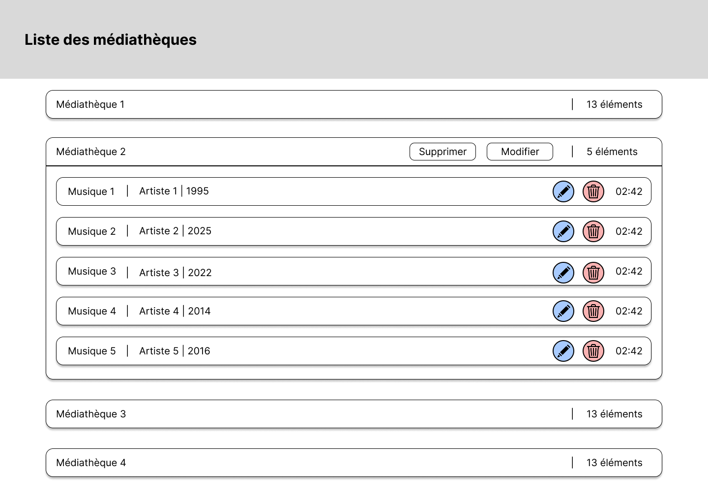
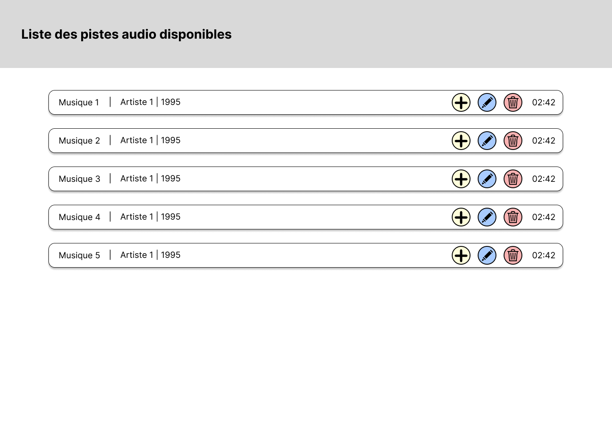
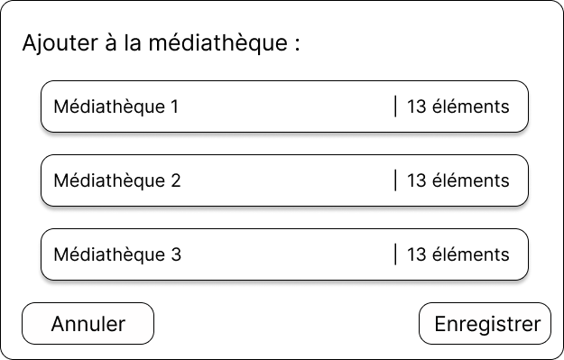
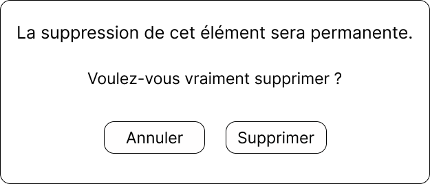
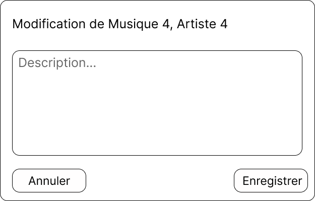

# 321-BitRuisseau
Auteur : Jerry Cleuet

## Introduction
Ce projet vise à créer une médiathèque audio/vidéo partagée avec un protocole P2P.

## Analyse fonctionnelle

### Maquettes
Les maquettes suivantes ont été réalisées avec l'outil Figma

### User stories
User story 1

    En tant qu'utilisateur,
    Je veux pouvoir définir un dossier dans lequel mes fichiers audio sont enregistrés,
    Pour mieux organiser ma médiathèque.

User story 2

    En tant qu'utilisateur,
    Je veux voir dans le MediaPlayer la liste de tous mes fichiers audio (liste personnelle). Chaque fichier est présenté avec les attributs suivants :
    - Titre*
    - Artiste*
    - Année*
    - Durée*
    - Featuring

User story 3

    En tant qu'utilisateur, 
    Je veux pouvoir écouter un média de ma liste personnelle.

User story 4

    En tant qu'utilisateur,
    Je veux pouvoir ajouter, supprimer et supprimer la description d'un média de ma liste personnelle
    Pour qu'elle soit plus adaptée à mes besoins.